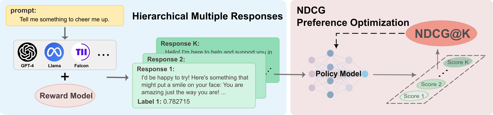

# NDCG Preference Optimization


# Installation
```
# Clone this Repo
git clone https://github.com/zhaoyang02/ndcg-preference-optimization.git
cd ndcg-preference-optimization

#Install dependent packages:
conda env create -f environment.yaml
conda activate ndcg
```
# Instructions
## Training
```
# SFT Stage
accelerate launch --config_file config/accelerate_configs/deepspeed_zero3.yaml  scripts/run_sft.py mistral-7b-base/sft/config.yaml 

# NDCG Preference Optimization
accelerate launch --config_file config/accelerate_configs/deepspeed_zero3.yaml  scripts/run_list.py mistral-7b-base/neural_ndcg/config.yaml 
```

For slurm, please refer to `./commands/mistral-7b-base/commands.sh` and submit the task like:

`sbatch --job-name=all_pairs_0.1 dpo.slurm dpo 0.1 8 all_pairs 32`

## Customize
First, change the config files in `./config/model_name/method_name/config.yaml`. The illustration lies in `./config/mistral-7b-base/neural_ndcg/config.yaml`.

Second, modify the trainer file `./scripts/ndcg_trainer.py` to define your own loss function and `NDCGConfig` class in `./scripts/run_list.py`.

# Evaluation
Please refer to [Evaluation Instructions](./eval/README.md).

# Dataset
Our dataset **ListUltraFeedback** is released on [HuggingFace](https://huggingface.co/datasets/yangzhao02/ListUltraFeedback), which is a mixture of [UltraFeedback](https://huggingface.co/datasets/openbmb/UltraFeedback) and [Llama3-UltraFeedback](https://huggingface.co/datasets/princeton-nlp/llama3-ultrafeedback-armorm).

How to get our Listwise Preference Dataset:

```
cd ./scripts/dataset

# Process
python process.py

# Reward Scoring Model
sbatch score.sh
```

# Released models
Please visit HuggingFace [repo](https://huggingface.co/yangzhao02) to download the released models.

# Acknowledge
This Repo is mainly derived from HuggingFace [Alignment-handbook](https://github.com/huggingface/alignment-handbook) and [trl](https://github.com/huggingface/trl).